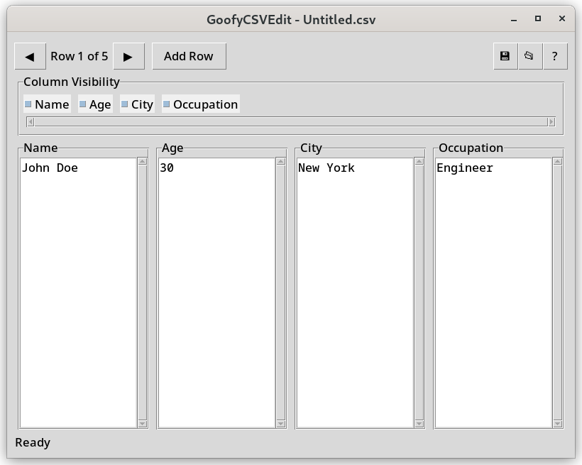

# GoofyCSVEdit
> Simple CSV Editor with Y2K vibes.
## Dependencies
You might have to [install the `tkinter` package](https://stackoverflow.com/questions/4783810/install-tkinter-for-python) if you don't have it already.
```bash
sudo apt-get install python3-tk
```
or 
```bash
sudo dnf install python3-tkinter
```
## Screenshot
